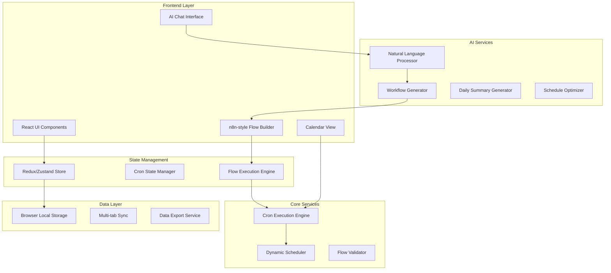

# Design Document: Crons - AI-Powered Cascading Task Calendar

## Overview

Crons is a modern AI-powered calendar and task management application that revolutionizes productivity through cascading cron flows. The system combines the visual clarity of Google Calendar with intelligent automation and n8n-style workflow building capabilities. Users can create complex task sequences that automatically unfold over time, with AI assistance for natural language workflow creation, intelligent scheduling, and daily summaries.

The application features a three-panel dashboard layout, an n8n-inspired visual flow builder, dual cron modes (Task Mode and Deadline Mode), and comprehensive AI integration for workflow generation and optimization.

## Architecture

### High-Level Architecture

