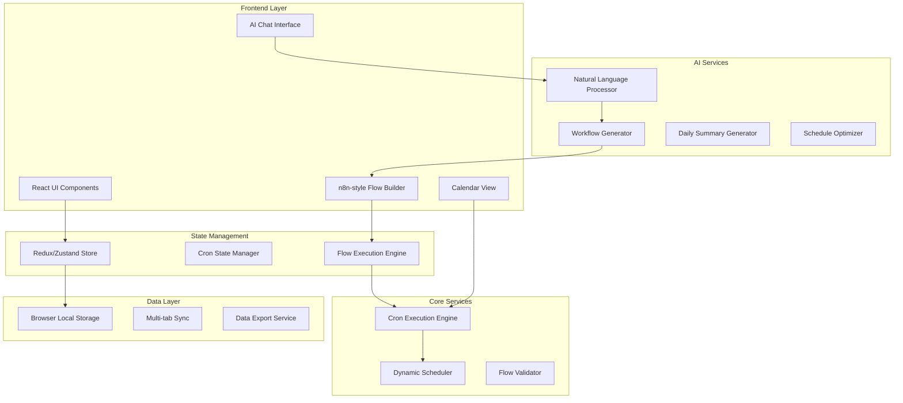

# Design Document: Crons - AI-Powered Cascading Task Calendar

## Overview

Crons is a modern AI-powered calendar and task management application that revolutionizes productivity through cascading cron flows. The system combines the visual clarity of Google Calendar with intelligent automation and n8n-style workflow building capabilities. Users can create complex task sequences that automatically unfold over time, with AI assistance for natural language workflow creation, intelligent scheduling, and daily summaries.

The application features a three-panel dashboard layout, an n8n-inspired visual flow builder, dual cron modes (Task Mode and Deadline Mode), and comprehensive AI integration for workflow generation and optimization.

## Architecture

### High-Level Architecture



### Technology Stack

- **Frontend Framework**: React 18 with TypeScript
- **State Management**: Zustand for lightweight state management
- **Calendar Component**: FullCalendar React with custom extensions
- **Flow Builder**: React Flow library for n8n-style visual editor
- **AI Integration**: OpenAI GPT-4 API for natural language processing
- **Styling**: Tailwind CSS with custom design system
- **Data Persistence**: Browser LocalStorage with IndexedDB fallback
- **Build Tool**: Vite for fast development and optimized builds

## Components and Interfaces

### Core Components

#### 1. Dashboard Layout (`DashboardLayout`)
```typescript
interface DashboardLayoutProps {
  sidebar: ReactNode;
  calendar: ReactNode;
  detailsPanel?: ReactNode;
  aiSummary: ReactNode;
}

const DashboardLayout: React.FC<DashboardLayoutProps> = ({
  sidebar,
  calendar,
  detailsPanel,
  aiSummary
}) => {
  return (
    <div className="flex h-screen bg-gray-50">
      <aside className="w-64 bg-white shadow-sm">{sidebar}</aside>
      <main className="flex-1 flex flex-col">
        <div className="p-4 bg-white border-b">{aiSummary}</div>
        <div className="flex-1 flex">
          <div className="flex-1">{calendar}</div>
          {detailsPanel && (
            <aside className="w-80 bg-white border-l">{detailsPanel}</aside>
          )}
        </div>
      </main>
    </div>
  );
};
```

#### 2. AI-Powered Flow Builder (`FlowBuilder`)
```typescript
interface FlowBuilderProps {
  initialFlow?: CronFlow;
  onSave: (flow: CronFlow) => void;
  aiMode?: boolean;
}

const FlowBuilder: React.FC<FlowBuilderProps> = ({
  initialFlow,
  onSave,
  aiMode = false
}) => {
  const [nodes, setNodes] = useState<Node[]>([]);
  const [edges, setEdges] = useState<Edge[]>([]);
  const [aiPrompt, setAiPrompt] = useState('');
  
  const handleAIGeneration = async (prompt: string) => {
    const generatedFlow = await aiService.generateFlow(prompt);
    setNodes(generatedFlow.nodes);
    setEdges(generatedFlow.edges);
  };
  
  return (
    <div className="h-full flex">
      {aiMode && (
        <div className="w-80 bg-white border-r p-4">
          <AIFlowGenerator onGenerate={handleAIGeneration} />
        </div>
      )}
      <div className="flex-1">
        <ReactFlow
          nodes={nodes}
          edges={edges}
          onNodesChange={onNodesChange}
          onEdgesChange={onEdgesChange}
          nodeTypes={customNodeTypes}
          edgeTypes={customEdgeTypes}
        >
          <Controls />
          <MiniMap />
          <Background />
        </ReactFlow>
      </div>
    </div>
  );
};
```

#### 3. Calendar Integration (`CronCalendar`)
```typescript
interface CronCalendarProps {
  crons: Cron[];
  onCronClick: (cron: Cron) => void;
  onCronComplete: (cronId: string) => void;
  view: 'month' | 'week' | 'day';
}

const CronCalendar: React.FC<CronCalendarProps> = ({
  crons,
  onCronClick,
  onCronComplete,
  view
}) => {
  const calendarEvents = useMemo(() => 
    crons.map(cron => ({
      id: cron.id,
      title: cron.title,
      start: cron.scheduledDate,
      end: cron.endDate,
      backgroundColor: getCronColor(cron),
      extendedProps: {
        cron,
        isDeadlineMode: cron.mode === 'deadline',
        remainingDays: cron.mode === 'deadline' ? 
          calculateRemainingDays(cron.deadline) : null
      }
    })), [crons]
  );
  
  return (
    <FullCalendar
      plugins={[dayGridPlugin, timeGridPlugin, interactionPlugin]}
      initialView={`${view}Grid`}
      events={calendarEvents}
      eventClick={handleEventClick}
      eventContent={renderCronEvent}
      headerToolbar={{
        left: 'prev,next today',
        center: 'title',
        right: 'dayGridMonth,timeGridWeek,timeGridDay'
      }}
    />
  );
};
```

#### 4. AI Chat Interface (`AIChatInterface`)
```typescript
interface AIChatInterfaceProps {
  onFlowGenerated: (flow: CronFlow) => void;
  templates: TemplatePrompt[];
}

const AIChatInterface: React.FC<AIChatInterfaceProps> = ({
  onFlowGenerated,
  templates
}) => {
  const [messages, setMessages] = useState<ChatMessage[]>([]);
  const [input, setInput] = useState('');
  const [isGenerating, setIsGenerating] = useState(false);
  
  const handleSubmit = async (prompt: string) => {
    setIsGenerating(true);
    try {
      const response = await aiService.processNaturalLanguage(prompt);
      if (response.type === 'flow') {
        onFlowGenerated(response.flow);
      }
      setMessages(prev => [...prev, 
        { role: 'user', content: prompt },
        { role: 'assistant', content: response.message }
      ]);
    } finally {
      setIsGenerating(false);
    }
  };
  
  return (
    <div className="flex flex-col h-full">
      <div className="p-4 border-b">
        <h3 className="font-semibold">AI Flow Creator</h3>
        <div className="flex gap-2 mt-2">
          {templates.map(template => (
            <button
              key={template.id}
              onClick={() => setInput(template.prompt)}
              className="px-3 py-1 bg-blue-100 text-blue-700 rounded-full text-sm"
            >
              {template.name}
            </button>
          ))}
        </div>
      </div>
      <ChatMessages messages={messages} />
      <ChatInput 
        value={input}
        onChange={setInput}
        onSubmit={handleSubmit}
        isLoading={isGenerating}
      />
    </div>
  );
};
```

### Custom Node Types for Flow Builder

#### Task Mode Node
```typescript
const TaskModeNode: React.FC<NodeProps> = ({ data, selected }) => {
  return (
    <div className={`
      bg-white border-2 rounded-lg p-4 min-w-48
      ${selected ? 'border-blue-500' : 'border-gray-200'}
      shadow-sm hover:shadow-md transition-shadow
    `}>
      <div className="flex items-center gap-2 mb-2">
        <CheckCircleIcon className="w-5 h-5 text-green-500" />
        <span className="font-medium text-sm text-gray-600">Task Mode</span>
      </div>
      <h4 className="font-semibold text-gray-900 mb-1">{data.title}</h4>
      <p className="text-sm text-gray-600 mb-2">{data.description}</p>
      <div className="text-xs text-gray-500">
        Duration: {data.duration}
      </div>
      <Handle type="target" position={Position.Top} />
      <Handle type="source" position={Position.Bottom} />
    </div>
  );
};
```

#### Deadline Mode Node
```typescript
const DeadlineModeNode: React.FC<NodeProps> = ({ data, selected }) => {
  const remainingDays = calculateRemainingDays(data.deadline);
  
  return (
    <div className={`
      bg-white border-2 rounded-lg p-4 min-w-48
      ${selected ? 'border-red-500' : 'border-gray-200'}
      shadow-sm hover:shadow-md transition-shadow
    `}>
      <div className="flex items-center gap-2 mb-2">
        <ClockIcon className="w-5 h-5 text-red-500" />
        <span className="font-medium text-sm text-gray-600">Deadline Mode</span>
      </div>
      <h4 className="font-semibold text-gray-900 mb-1">{data.title}</h4>
      <p className="text-sm text-gray-600 mb-2">{data.description}</p>
      <div className="flex justify-between text-xs">
        <span className="text-gray-500">Due: {formatDate(data.deadline)}</span>
        <span className={`font-medium ${
          remainingDays <= 1 ? 'text-red-600' : 
          remainingDays <= 3 ? 'text-yellow-600' : 'text-green-600'
        }`}>
          {remainingDays}d left
        </span>
      </div>
      <Handle type="target" position={Position.Top} />
      <Handle type="source" position={Position.Bottom} />
    </div>
  );
};
```

## Data Models

### Core Data Structures

#### Cron Model
```typescript
interface Cron {
  id: string;
  title: string;
  description?: string;
  mode: 'task' | 'deadline';
  status: 'pending' | 'active' | 'completed' | 'overdue';
  
  // Scheduling
  scheduledDate?: Date;
  deadline?: Date; // For deadline mode
  duration: number; // in minutes
  
  // Flow relationship
  flowId: string;
  nodeId: string;
  dependencies: string[]; // Node IDs this cron depends on
  
  // Metadata
  createdAt: Date;
  updatedAt: Date;
  completedAt?: Date;
  
  // AI-readable format
  aiContext: {
    priority: 'low' | 'medium' | 'high';
    category: string;
    tags: string[];
    estimatedEffort: number;
  };
}
```

#### Cron Flow Model
```typescript
interface CronFlow {
  id: string;
  name: string;
  description?: string;
  
  // Flow structure (React Flow format)
  nodes: FlowNode[];
  edges: FlowEdge[];
  
  // Execution state
  status: 'draft' | 'active' | 'paused' | 'completed';
  currentActiveNodes: string[];
  
  // Template information
  isTemplate: boolean;
  templateCategory?: string;
  
  // AI generation metadata
  generatedFromPrompt?: string;
  aiOptimizations?: string[];
  
  // Timestamps
  createdAt: Date;
  startedAt?: Date;
  completedAt?: Date;
}

interface FlowNode {
  id: string;
  type: 'taskMode' | 'deadlineMode' | 'conditional' | 'parallel';
  position: { x: number; y: number };
  data: {
    title: string;
    description?: string;
    duration: number;
    schedulingRule: SchedulingRule;
    mode: 'task' | 'deadline';
    deadline?: Date;
  };
}

interface FlowEdge {
  id: string;
  source: string;
  target: string;
  type: 'default' | 'conditional';
  data?: {
    condition?: string;
    delay?: SchedulingRule;
  };
}
```

#### Scheduling Rules
```typescript
interface SchedulingRule {
  type: 'immediate' | 'relative' | 'absolute' | 'business_day';
  
  // For relative scheduling (T+N)
  relativeDays?: number; // T+1, T+3, etc.
  relativeHours?: number;
  
  // For absolute scheduling
  specificDate?: Date;
  specificTime?: string; // "09:00"
  
  // For business day scheduling
  businessDayOffset?: number; // Next business day = 1
  timeOfDay?: string; // "morning", "afternoon", "09:00"
}
```

#### AI Template Prompts
```typescript
interface TemplatePrompt {
  id: string;
  name: string;
  prompt: string;
  category: 'project' | 'personal' | 'business' | 'health' | 'custom';
  description: string;
  isUserCreated: boolean;
  usageCount: number;
  
  // Example generated flows for preview
  exampleFlow?: CronFlow;
}
```

### AI Service Interfaces

#### Natural Language Processing
```typescript
interface AIService {
  processNaturalLanguage(prompt: string): Promise<AIResponse>;
  generateFlow(description: string): Promise<CronFlow>;
  optimizeFlow(flow: CronFlow): Promise<FlowOptimization>;
  generateDailySummary(crons: Cron[]): Promise<string>;
  suggestTemplates(userBehavior: UserBehavior): Promise<TemplatePrompt[]>;
}

interface AIResponse {
  type: 'flow' | 'clarification' | 'suggestion';
  message: string;
  flow?: CronFlow;
  suggestions?: string[];
  confidence: number;
}

interface FlowOptimization {
  originalFlow: CronFlow;
  optimizedFlow: CronFlow;
  improvements: {
    type: 'scheduling' | 'dependency' | 'duration';
    description: string;
    impact: 'low' | 'medium' | 'high';
  }[];
  estimatedTimeSaving: number; // in hours
}
```

## Correctness Properties

*A property is a characteristic or behavior that should hold true across all valid executions of a system—essentially, a formal statement about what the system should do. Properties serve as the bridge between human-readable specifications and machine-verifiable correctness guarantees.*

Based on the prework analysis, I've identified the following properties that can be validated through property-based testing. After reviewing for redundancy, I've consolidated related properties to ensure each provides unique validation value.

### Core Calendar and UI Properties

**Property 1: Cron Visual Consistency**
*For any* cron displayed on the calendar, it should have a flow-specific color and display a chain link icon if it belongs to a cascading flow
**Validates: Requirements 1.3, 1.4**

**Property 2: Tooltip Information Completeness**
*For any* cron on the calendar, hovering should display a tooltip containing the cron name, flow name, and duration
**Validates: Requirements 1.5**

**Property 3: Details Panel Completeness**
*For any* cron clicked by a user, the details panel should display all required information: title, flow name, status toggle, scheduled time, and duration
**Validates: Requirements 2.1, 2.2**

### Cascading Flow Execution Properties

**Property 4: Cascading Activation**
*For any* completed cron in a flow, the system should automatically activate all directly connected next cron nodes according to their scheduling rules
**Validates: Requirements 2.3, 2.5, 7.1**

**Property 5: Dynamic Calendar Integration**
*For any* task mode cron, it should appear on the calendar only after its parent dependencies are completed, while deadline mode crons should always show countdown information
**Validates: Requirements 5.1, 5.2, 5.3, 6.2**

**Property 6: Scheduling Rule Application**
*For any* cron with scheduling rules (T+1, T+3, custom timing), the system should correctly calculate and apply the scheduling when the cron becomes active
**Validates: Requirements 5.7, 7.2**

**Property 7: Flow State Consistency**
*For any* active cron flow, the system should maintain accurate state tracking where each node is correctly marked as active, completed, or waiting for dependencies
**Validates: Requirements 6.1, 6.3, 7.5**

**Property 8: Visual Mode Indicators**
*For any* cron, it should display the correct visual indicator (completion icon for task mode, clock/countdown icon for deadline mode) based on its mode
**Validates: Requirements 5.5**

**Property 9: Parallel Execution Support**
*For any* cron that has multiple dependent crons, completing it should activate all dependent crons simultaneously according to their individual scheduling rules
**Validates: Requirements 7.3**

### Flow Builder and Validation Properties

**Property 10: Node Configuration Flexibility**
*For any* custom cron node created in the flow builder, it should accept and store configurable titles, descriptions, and mode settings
**Validates: Requirements 4.3**

**Property 11: Dependency Connection Establishment**
*For any* two cron nodes connected in the flow builder, a valid dependency relationship should be established between them
**Validates: Requirements 4.4**

**Property 12: Circular Dependency Prevention**
*For any* cron flow with circular dependencies, the system should reject it during validation and prevent saving
**Validates: Requirements 4.6**

**Property 13: Deadline Countdown Display**
*For any* deadline mode cron, the system should calculate and display the correct remaining days countdown in the calendar view
**Validates: Requirements 4.7, 5.4**

**Property 14: Mixed-Mode Flow Support**
*For any* cron flow containing both task mode and deadline mode crons, the system should handle execution correctly with appropriate scheduling for each mode
**Validates: Requirements 5.6**

### AI Integration Properties

**Property 15: AI Flow Generation**
*For any* natural language workflow description provided to the AI, it should generate a complete n8n-style flow with appropriate nodes and connections
**Validates: Requirements 11.2**

**Property 16: AI-Generated Flow Editability**
*For any* AI-generated cron flow, it should be fully editable using the visual flow builder with the same functionality as manually created flows
**Validates: Requirements 11.3, 11.4**

**Property 17: Template Generation from Prompts**
*For any* user-provided template prompt, the AI should generate template variations that can be saved and reused
**Validates: Requirements 12.3**

**Property 18: Template Persistence**
*For any* user-created template prompt, the system should save it for future use and make it available in subsequent sessions
**Validates: Requirements 12.4**

**Property 19: Template Suggestion Relevance**
*For any* natural language description, the AI should suggest relevant templates based on the content and user behavior patterns
**Validates: Requirements 12.5**

**Property 20: Daily Summary Intelligence**
*For any* set of daily crons, the AI should generate a meaningful summary that highlights priorities, deadlines, and dependencies
**Validates: Requirements 13.3**

**Property 21: Dynamic Summary Updates**
*For any* changes to daily crons (completion, modification), the AI summary should update dynamically to reflect the current state
**Validates: Requirements 13.4**

**Property 22: Summary Priority Highlighting**
*For any* daily summary generated by AI, it should highlight urgent deadlines, overdue tasks, and upcoming dependencies
**Validates: Requirements 13.5**

### Data Persistence Properties

**Property 23: Comprehensive Data Persistence**
*For any* cron flow template, active flow, or cron state, the system should persist it to local storage and maintain it across browser sessions
**Validates: Requirements 15.1, 15.2**

**Property 24: Data Export Completeness**
*For any* request to export data, the system should provide complete export functionality for cron flow templates and cron history
**Validates: Requirements 15.4**

**Property 25: Data Integrity Validation**
*For any* corrupted or invalid data state, the system should validate data integrity and handle the corruption gracefully without crashing
**Validates: Requirements 15.5**

**Property 26: AI-Readable Data Format**
*For any* cron data stored in the system, it should be in an AI-readable format that enables intelligent summarization and analysis
**Validates: Requirements 13.2**

## Error Handling

### Flow Execution Errors

**Circular Dependency Detection**
- Validate flow graphs before execution using topological sorting
- Prevent saving flows with circular dependencies
- Provide clear error messages with visual highlighting of problematic connections

**Missing Dependency Handling**
- Gracefully handle cases where parent crons are deleted or corrupted
- Orphaned crons should be marked as "dependency missing" and require user intervention
- Provide repair suggestions for broken flow chains

**Scheduling Conflicts**
- Detect when multiple crons are scheduled for the same time slot
- Provide conflict resolution UI with options to reschedule or prioritize
- AI assistant should suggest optimal conflict resolution

### AI Service Errors

**Natural Language Processing Failures**
- Handle cases where AI cannot parse user input
- Provide clarifying questions to gather more specific requirements
- Fallback to template suggestions when generation fails

**API Rate Limiting and Failures**
- Implement exponential backoff for AI API calls
- Cache AI responses to reduce API usage
- Provide offline mode with limited functionality when AI services are unavailable

**Invalid Flow Generation**
- Validate AI-generated flows before presenting to user
- Reject flows with impossible scheduling or circular dependencies
- Allow user to provide feedback to improve future generations

### Data Persistence Errors

**Storage Quota Exceeded**
- Monitor local storage usage and warn users before limits
- Implement data cleanup for old completed flows
- Provide export functionality before cleanup

**Data Corruption Recovery**
- Implement data validation on load with automatic repair where possible
- Maintain backup copies of critical flow templates
- Graceful degradation when data cannot be recovered

## Testing Strategy

### Dual Testing Approach

The testing strategy employs both unit testing and property-based testing to ensure comprehensive coverage:

**Unit Tests**: Focus on specific examples, edge cases, and integration points
- UI component rendering and interaction
- Specific scheduling rule calculations (T+1, T+3, business days)
- AI service integration points
- Error handling scenarios
- Data persistence operations

**Property-Based Tests**: Verify universal properties across all inputs using fast-check library
- Generate random cron flows and verify cascading behavior
- Test scheduling rules with random dates and configurations
- Validate AI-generated flows meet structural requirements
- Ensure data persistence works with various data shapes
- Verify UI consistency across different cron configurations

### Property-Based Testing Configuration

**Library**: fast-check for TypeScript/JavaScript property-based testing
**Test Iterations**: Minimum 100 iterations per property test
**Test Tagging**: Each property test must reference its design document property

Example property test structure:
```typescript
// Feature: cascading-task-calendar, Property 4: Cascading Activation
test('cascading activation property', () => {
  fc.assert(fc.property(
    cronFlowArbitrary(),
    (flow) => {
      const engine = new CronExecutionEngine(flow);
      const completedCron = selectRandomActiveCron(flow);
      
      engine.completeCron(completedCron.id);
      
      const nextCrons = getDirectDependents(completedCron, flow);
      nextCrons.forEach(cron => {
        expect(engine.getCronStatus(cron.id)).toBe('active');
        expect(engine.getCronScheduledDate(cron.id)).toBeDefined();
      });
    }
  ), { numRuns: 100 });
});
```

### Test Data Generation

**Smart Generators**: Create intelligent arbitraries that generate realistic test data
- Cron flows with valid dependency structures
- Realistic scheduling rules and date ranges
- Mixed-mode flows with both task and deadline crons
- Natural language prompts for AI testing

**Edge Case Coverage**: Ensure generators include edge cases
- Empty flows and single-node flows
- Flows with maximum complexity (branching, parallel paths)
- Boundary dates (weekends, holidays, year boundaries)
- Extreme scheduling rules (same-day, far-future dates)

### Integration Testing

**Calendar Integration**: Test FullCalendar integration with dynamic cron data
**AI Service Integration**: Test OpenAI API integration with mock responses and error scenarios
**Multi-tab Synchronization**: Test data consistency across multiple browser tabs
**Mobile Responsiveness**: Test UI adaptation across different screen sizes

### Performance Testing

**Large Flow Handling**: Test performance with flows containing 100+ nodes
**Calendar Rendering**: Test calendar performance with 1000+ crons
**AI Response Times**: Monitor and test AI service response times
**Memory Usage**: Test for memory leaks during long-running sessions

<function_calls>
<invoke name="prework">
<parameter name="featureName">cascading-task-calendar